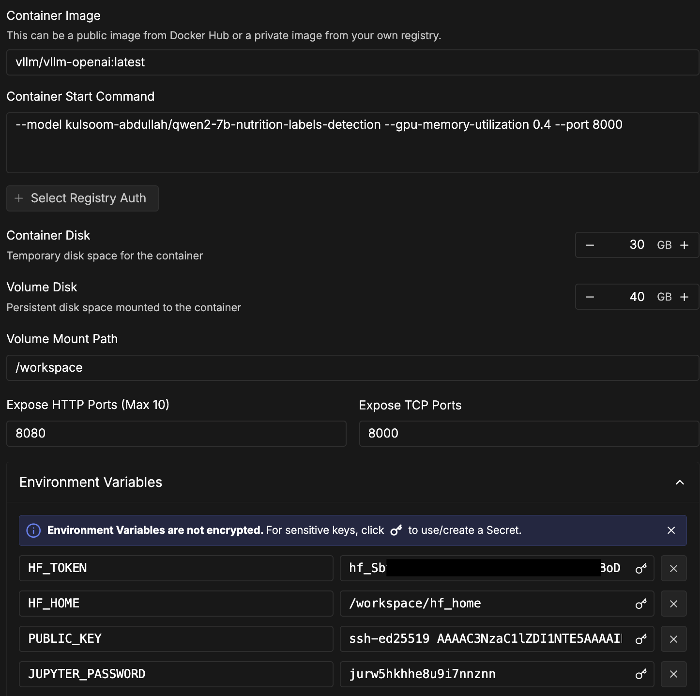
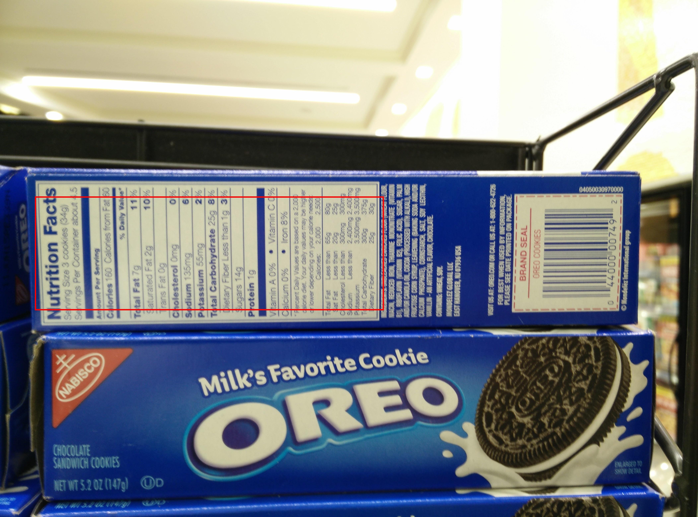

# Quantization Benchmark Results

Performance comparison of bfloat16 baseline vs FP8 quantization for Qwen2-VL-7B nutrition label detection model.

## Experimental Setup

**Infrastructure**: RunPod RTX 6000 Ada (48GB VRAM)
**Container**: `vllm/vllm-openai:latest`
**vLLM Version**: 0.11.0
**Model**: `kulsoom-abdullah/qwen2-7b-nutrition-labels-detection`
**GPU Memory Utilization**: 0.5 (50%)
**Max Model Length**: 4096 tokens
**Test Image**: [OpenFoodFacts Sample](https://static.openfoodfacts.org/images/products/004/400/000/7492/1.jpg) (1024x759)
**Benchmark**: 5 inference requests per configuration

## Results

### Baseline (bfloat16)

**GPU Memory**: 22,798 MB (22.8 GB)
**Inference Latency**:
- Mean: 2,021 ms
- Min: 593 ms
- Max: 7,717 ms (first request - cold start)
- **Steady-state**: ~600 ms

**Model Output**: `[0.05, 0.38, 0.55, 0.6]` (normalized bounding box coordinates)

### Quantized (FP8)

**GPU Memory**: 23,112 MB (23.1 GB total)
**Model Weights**: 8.8 GB (45% reduction from bfloat16's ~15 GB)
**Inference Latency**:
- Mean: 1,706 ms
- Min: 371 ms
- Max: 7,030 ms (first request - cold start)
- **Steady-state**: ~375 ms (37% faster than bfloat16)

**Model Output**: `[0.05, 0.38, 0.55, 0.6]` (identical to bfloat16 - accuracy preserved)

**Hardware Note**: RTX 6000 Ada lacks native FP8 tensor cores and uses Marlin kernel fallback. While model weights reduced by 45%, total GPU memory remained similar due to hardware limitations. For production deployments requiring maximum memory efficiency, use GPUs with native FP8 support (H100/H200).

## Comparison

| Metric | bfloat16 | FP8 | Change |
|:-------|:--------:|:---:|:------:|
| **Model Weights** | ~15 GB | 8.8 GB | **-45%** ✅ |
| **Total GPU Memory** | 22.8 GB | 23.1 GB | +1% |
| **Steady-state Latency** | ~600 ms | ~375 ms | **-37%** ✅ |
| **Prediction Accuracy** | ✓ | ✓ | Identical |

## Analysis

### Memory Impact
FP8 quantization reduced model weights by **45%** (15 GB → 8.8 GB). However, total GPU memory remained similar (22.8 GB → 23.1 GB) because:
1. KV cache dominates memory allocation (~50% of 48GB = 24GB pre-allocated)
2. RTX 6000 Ada uses Marlin kernel fallback (no native FP8 support)

**For production**: Native FP8 GPUs (H100/H200) would show greater total memory savings, enabling higher throughput or larger batch sizes.

### Latency Impact
FP8 achieved **37% faster inference** (600ms → 375ms steady-state). Despite using fallback kernels, quantization provided significant speedup through reduced memory bandwidth and computation.

### Production Recommendation
**Use FP8 quantization** for this model because:
- ✅ 45% smaller model weights (faster loading, easier deployment)
- ✅ 37% faster inference (lower latency, higher throughput)
- ✅ Identical accuracy (same predictions as bfloat16)
- ✅ Lower compute cost per inference

**Hardware**: Deploy on H100/H200 for maximum memory efficiency, or RTX 6000 Ada for cost-effective performance with acceptable memory usage.

---

**Note**: First request includes model warmup overhead (~7s). Production deployments should use warmup requests before serving traffic.
