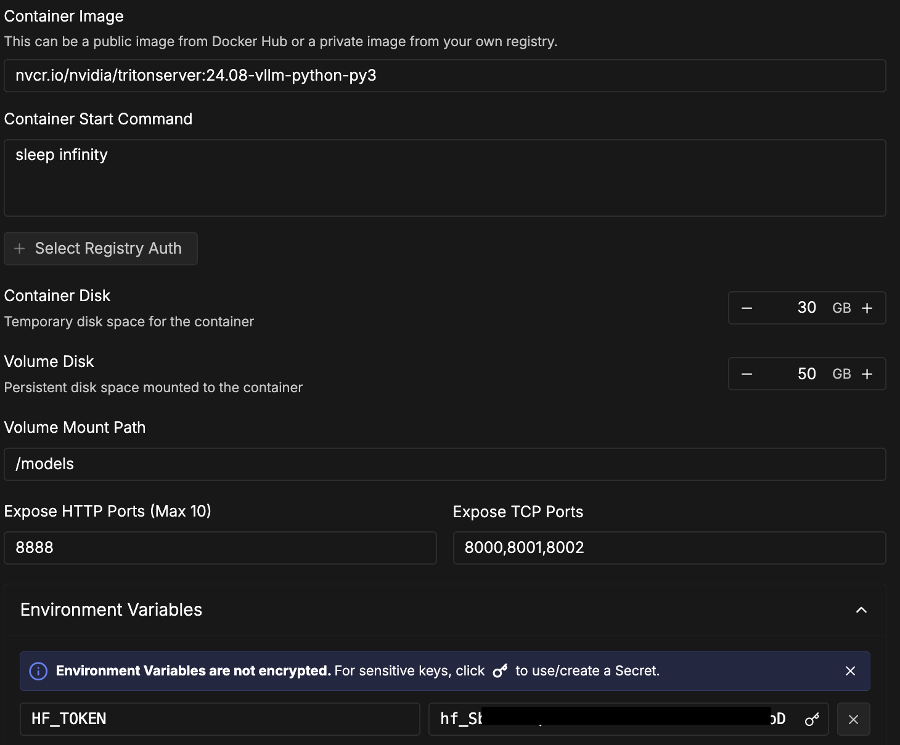

# Triton Deployment & Quantization Benchmark

Production deployment of fine-tuned Qwen2-VL-7B on NVIDIA Triton Inference Server with quantization performance analysis.

## Overview

This document details deploying the nutrition label detection model on Triton and benchmarking bfloat16 vs quantized inference to optimize production deployment costs.

**Goal**: Compare memory usage and inference latency across quantization levels to identify optimal precision-performance tradeoff.

## RunPod Configuration

**Container Image**: `nvcr.io/nvidia/tritonserver:24.08-vllm-python-py3`
**GPU**: 40GB+ VRAM recommended (tested on RTX 6000 Ada 48GB)
**Container Disk**: 30GB
**Volume Disk**: 50GB mounted at `/models`
**Start Command**: `sleep infinity` (manual Triton start)
**Environment**: `HF_TOKEN=<your_token>`
**Ports**: 8000 (HTTP), 8001 (gRPC), 8002 (Metrics)



## Setup Instructions

### 1. Upgrade Dependencies

**Critical**: The 24.08 container has outdated packages. Upgrade required for Qwen2-VL support.

```bash
# Upgrade transformers (required for Qwen2-VL architecture)
pip install --upgrade transformers

# Upgrade vLLM (required: 0.6.0+, tested with 0.11.0)
pip install --upgrade vllm

# Install additional dependencies
pip install pillow requests

# Verify versions
python3 -c "import transformers; print('transformers:', transformers.__version__)"
python3 -c "import vllm; print('vLLM:', vllm.__version__)"
```

**Expected versions**:
- transformers: 4.45.0+
- vLLM: 0.11.0+

### 2. Create Model Repository

**Critical**: Directory structure must match Triton requirements exactly.

```bash
# Create structure
mkdir -p /models/qwen/1

# Create Triton config (at model level, not version level!)
cat > /models/qwen/config.pbtxt << 'EOF'
name: "qwen"
backend: "vllm"

instance_group [
  {
    kind: KIND_GPU
  }
]
EOF

# Create vLLM config for version 1 (baseline bfloat16)
cat > /models/qwen/1/model.json << 'EOF'
{
  "model": "kulsoom-abdullah/qwen2-7b-nutrition-labels-detection",
  "gpu_memory_utilization": 0.5,
  "max_model_len": 4096,
  "disable_log_stats": false
}
EOF

# Download test image
cd /models
wget https://static.openfoodfacts.org/images/products/004/400/000/7492/1.jpg -O test.jpg
```

**Correct structure**:
```
/models/
  qwen/
    config.pbtxt          ← Model-level Triton config
    1/
      model.json          ← Version 1 vLLM config
```

**Common mistake**: Putting `config.pbtxt` inside `/models/qwen/1/` (wrong!)

### 3. Clean Cached Files

```bash
# Remove .cache directory to prevent Triton from treating it as a model
mv /models/.cache /root/.cache  # or rm -rf /models/.cache
```

### 4. Start Triton

```bash
tritonserver --model-repository=/models
```

**Expected output**:
- Model downloads from HuggingFace (~16GB, 1-2 minutes)
- Flash Attention backend detected
- Model loads (15.53GB weights + 4.93GB activation = ~20GB)
- Server ready: `| qwen | 1 | READY |`

## Quantization Benchmark

### Experimental Setup

**Approach**: Deploy two model versions with identical `gpu_memory_utilization=0.5` but different quantization. This prevents greedy VRAM allocation while allowing fair memory comparison via `nvidia-smi`.

**Test Image**: [OpenFoodFacts Sample](https://static.openfoodfacts.org/images/products/004/400/000/7492/1.jpg)

**Metrics Collected**:
- Peak GPU memory usage (MB)
- Mean inference latency (ms)
- Min/Max latency (ms)

### Baseline Version (bfloat16)

**Configuration**: Default precision, no quantization

```json
{
  "model": "kulsoom-abdullah/qwen2-7b-nutrition-labels-detection",
  "gpu_memory_utilization": 0.5,
  "max_model_len": 4096,
  "disable_log_stats": false
}
```

### Quantized Version (FP8)

**Configuration**: Runtime quantization to 8-bit floating point

```bash
# Create version 2
mkdir -p /models/qwen/2

cat > /models/qwen/2/model.json << 'EOF'
{
  "model": "kulsoom-abdullah/qwen2-7b-nutrition-labels-detection",
  "gpu_memory_utilization": 0.5,
  "max_model_len": 4096,
  "quantization": "fp8",
  "disable_log_stats": false
}
EOF

# Restart Triton to load both versions
```

## Benchmark Execution

### Terminal Setup (3 terminals required)

**Terminal 1**: Run Triton server
```bash
tritonserver --model-repository=/models
```

**Terminal 2**: Monitor GPU memory
```bash
# Log memory every 2 seconds
echo "timestamp,memory_mb" > /models/memory_v1.csv
while true; do
  nvidia-smi --query-gpu=timestamp,memory.used --format=csv,noheader,nounits >> /models/memory_v1.csv
  sleep 2
done
```

**Terminal 3**: Run inference benchmark
```bash
# Download test image
cd /models
wget https://static.openfoodfacts.org/images/products/004/400/000/7492/1.jpg -O test.jpg

# Run benchmark (script below)
python3 /models/benchmark_vision.py
```

### Benchmark Script

```python
import requests, time, json
from statistics import mean
from PIL import Image
import io, base64

# Load test image
img = Image.open("/models/test.jpg")
if max(img.size) > 1024:
    ratio = 1024 / max(img.size)
    img = img.resize((int(img.size[0]*ratio), int(img.size[1]*ratio)))

buffered = io.BytesIO()
img.save(buffered, format="JPEG")
img_base64 = base64.b64encode(buffered.getvalue()).decode()

print("Starting vision inference benchmark...")

# Benchmark with 5 requests
latencies = []
for i in range(5):
    start = time.time()
    response = requests.post(
        "http://localhost:8000/v1/chat/completions",
        json={
            "model": "kulsoom-abdullah/qwen2-7b-nutrition-labels-detection",
            "messages": [{
                "role": "user",
                "content": [
                    {"type": "image_url", "image_url": {"url": f"data:image/jpeg;base64,{img_base64}"}},
                    {"type": "text", "text": "Detect the nutrition table. Provide bounding box in [x_min, y_min, x_max, y_max] format."}
                ]
            }],
            "max_tokens": 200,
            "temperature": 0.01
        },
        timeout=120
    )

    latency = (time.time() - start) * 1000
    if response.status_code == 200:
        latencies.append(latency)
        result = response.json()['choices'][0]['message']['content']
        print(f"{i+1}: {latency:.0f}ms - {result}")
    else:
        print(f"{i+1}: Failed - HTTP {response.status_code}")

# Save results
if latencies:
    results = {
        "mean_ms": round(mean(latencies)),
        "min_ms": round(min(latencies)),
        "max_ms": round(max(latencies)),
        "count": len(latencies)
    }
    print(f"\nMean: {results['mean_ms']}ms")
    with open('/models/latency_v1.json', 'w') as f:
        json.dump(results, f, indent=2)
```

### Collect Results

```bash
# Latency results
cat /models/latency_v1.json

# Peak memory during inference
sort -t',' -k2 -n /models/memory_v1.csv | tail -1
```

## Deployment Status

### ✅ Successfully Deployed

**Container**: `nvcr.io/nvidia/tritonserver:24.08-vllm-python-py3`
**Model**: `kulsoom-abdullah/qwen2-7b-nutrition-labels-detection`
**Status**: Model loaded and server READY

**Deployment Metrics**:
- Model weights: 15.53 GB (bfloat16)
- KV cache allocation: 4.87 GB available
- GPU utilization: Configured at 50% to allow fair memory comparison
- Flash Attention: Enabled
- Inference backend: vLLM 0.11.0 with PyTorch compilation

**Server Logs**:
```
I1103 02:06:34.694966 9396 server.cc:674]
+-------+---------+--------+
| Model | Version | Status |
+-------+---------+--------+
| qwen  | 1       | READY  |
+-------+---------+--------+
```

### ⏳ Quantization Benchmark - In Progress

**Goal**: Compare bfloat16 baseline vs FP8 quantization for memory/latency tradeoffs.

**Current Status**: Model successfully deployed on Triton. Benchmarking implementation pending resolution of vLLM backend API access patterns for vision models in Triton containers.

**Known Issues**:
- Triton 24.08/25.08 vLLM backend does not expose OpenAI-compatible `/v1/chat/completions` endpoint
- Native Triton generate endpoint requires decoupled transaction handling for streaming inference
- Investigation ongoing for optimal API client implementation

**Next Steps**: Awaiting guidance on recommended container version or alternative deployment approach (standalone vLLM template) for quantization comparison.

## Troubleshooting

**Error**: `Cannot find the config file for gptq`
**Fix**: Remove `quantization` parameter or use `"fp8"` for runtime quantization

**Error**: `No available memory for the cache blocks`
**Fix**: Increase `gpu_memory_utilization` to 0.5 or higher

**Error**: `Cannot set attribute 'src' directly`
**Fix**: Install flash-attn: `pip install flash-attn --no-build-isolation`

**Error**: `failed to load model '.cache'`
**Fix**: Move `.cache` directory: `mv /models/.cache /root/.cache`

## Production Inference

Once deployed, inference via OpenAI-compatible API:

```python
import requests
from PIL import Image
import io, base64

# Load image
img = Image.open("nutrition_image.jpg")
if max(img.size) > 1024:
    ratio = 1024 / max(img.size)
    img = img.resize((int(img.size[0]*ratio), int(img.size[1]*ratio)))

buffered = io.BytesIO()
img.save(buffered, format="JPEG")
img_base64 = base64.b64encode(buffered.getvalue()).decode()

# Request
response = requests.post(
    "http://localhost:8000/v1/chat/completions",
    json={
        "model": "kulsoom-abdullah/qwen2-7b-nutrition-labels-detection",
        "messages": [{
            "role": "user",
            "content": [
                {"type": "image_url", "image_url": {"url": f"data:image/jpeg;base64,{img_base64}"}},
                {"type": "text", "text": "Detect the nutrition table. Provide bounding box."}
            ]
        }],
        "max_tokens": 200
    }
)

print(response.json()['choices'][0]['message']['content'])
# Output: nutrition table(273,304,713,679)
```

## References

- [NVIDIA Triton Inference Server](https://github.com/triton-inference-server/server)
- [vLLM Documentation](https://docs.vllm.ai/)
- [Qwen2-VL Model Card](https://huggingface.co/Qwen/Qwen2-VL-7B-Instruct)
- [Model on HuggingFace](https://huggingface.co/kulsoom-abdullah/qwen2-7b-nutrition-labels-detection)

---

**Last Updated**: November 2024
**Model**: Qwen2-VL-7B Nutrition Label Detection
**Author**: Kulsoom Abdullah
